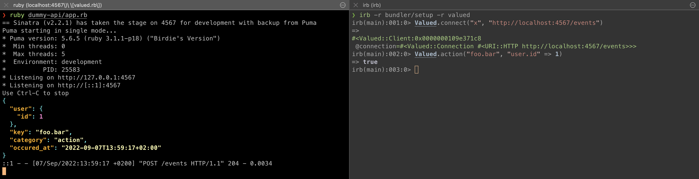

# Valued API Dummy

You can run `app.rb` to launch a stand-in for the Valued API. It will output any event payloads received to the console, with some highlighting.

## Development Setup

### Prerequisites

- Ruby: https://www.ruby-lang.org/en/

### Local setup

Install ruby via [asdf](https://asdf-vm.com/).

If you don't already have the asdf ruby plugin installed run `asdf plugin add ruby https://github.com/asdf-vm/asdf-ruby.git`

Run `asdf install` to install `ruby`

Run `bundle install` to install gems

To start the server run `ruby app.rb`
